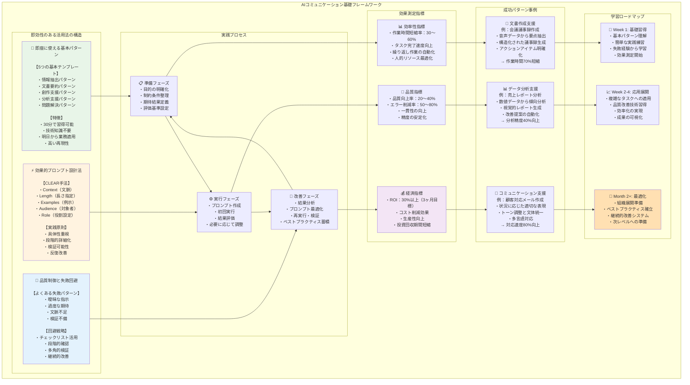

# 第1章：即効性のある活用法

## はじめに

生成AIの活用において最も重要なのは、理論的な理解ではなく実践的な成功体験である。本章では、技術的な背景知識がなくても30分で習得でき、明日から業務で使える具体的な手法を提示する。複雑な概念の学習は後回しにして、まずは「AIとの効果的なコミュニケーション」を体験していただきたい。

> **この章で学ぶこと**
> - 5つの基本テンプレート（情報抽出・要約・創作支援・分析支援・問題解決）を使って、日常業務の1つをAIに任せる体験をすること
> - CLEAR 手法などの基本的なプロンプト設計の考え方を押さえ、「なんとなく聞く」から「意図して指示する」に切り替えること
> - 失敗例と簡単なチェックリストを通じて、「どこを直せば結果が改善するか」を自分で確認できるようになること
> ここで扱うテンプレートだけでも、十分に業務の一部を効率化できる。後続章の高度な内容は、まずこの章のパターンに慣れてから読み進めても問題ない。



### 📊 学習効果の可視化

本章で身につけるスキルの効果を測定するため、以下の指標を追跡します。

```text
✅ 学習目標達成度
┌─────────────────────────────────────────────────────┐
│ 基本パターン習得    [████████████████████] 100%      │
│ 失敗回避スキル      [████████████████████] 100%      │  
│ 効果測定の実践      [████████████████████] 100%      │
│ 実業務への適用      [████████████████████] 100%      │
└─────────────────────────────────────────────────────┘

💡 期待効果
・作業時間短縮：30〜60%
・品質向上：20〜40%  
・エラー削減：50〜80%
・ROI：30%以上（第3ヶ月目標）
```

---

## 1.1 プロンプト設計フローチャート

効果的なプロンプトを作成するための体系的なアプローチを、フローチャート形式で可視化します。

```text
🎯 プロンプト設計フローチャート
┌─────────────────────────────────────────────────────────────────┐
│                        START：問題・課題の明確化                  │
└─────────────────────┬───────────────────────────────────────────┘
                      │
                      ▼
┌─────────────────────────────────────────────────────────────────┐
│                    STEP 1：情報整理                            │
│ ┌─────────────┐ ┌─────────────┐ ┌─────────────┐ ┌─────────────┐ │
│ │     背景     │ │     目的     │ │     制約     │ │     形式     │ │
│ │   現状分析   │ │  達成目標   │ │   制限事項   │ │  期待形式   │ │
│ └─────────────┘ └─────────────┘ └─────────────┘ └─────────────┘ │
└─────────────────────┬───────────────────────────────────────────┘
                      │
                      ▼
┌─────────────────────────────────────────────────────────────────┐
│                  STEP 2：複雑度判定                            │
│                                                                │
│              シンプル ←─────→ 複雑                               │
│                 │               │                              │
│            直接質問型       段階分解型                            │
└─────────────────────┬─────────────┬─────────────────────────────┘
                      │             │
                      ▼             ▼
┌─────────────────────────────┐ ┌─────────────────────────────┐
│      STEP 3A：直接質問       │ │     STEP 3B：段階分解       │
│                             │ │                             │
│ ・構造化質問テンプレート      │ │ ・ステップ1：問題特定        │
│ ・明確な条件設定             │ │ ・ステップ2：要因分析        │
│ ・期待形式の指定             │ │ ・ステップ3：解決策提案      │
└─────────────┬───────────────┘ └─────────────┬───────────────┘
                │                               │
                └─────────────┬─────────────────┘
                              │
                              ▼
┌─────────────────────────────────────────────────────────────────┐
│                   STEP 4：品質検証                             │
│                                                                │
│ ✅ 明確性：指示が具体的で理解しやすいか                           │
│ ✅ 完全性：必要な情報がすべて含まれているか                       │
│ ✅ 一貫性：矛盾する要求が含まれていないか                        │
│ ✅ 実現性：AIが対応可能な範囲内か                               │
└─────────────────────┬───────────────────────────────────────────┘
                      │
                      ▼
┌─────────────────────────────────────────────────────────────────┐
│                 STEP 5：実行と改善                             │
│                                                                │
│ 1️⃣ 初回実行 → 2️⃣ 結果評価 → 3️⃣ 改善指示 → 4️⃣ 最終化           │
│                                                                │
│         🔄 反復改善サイクル                                     │
└─────────────────────────────────────────────────────────────────┘
```

### 📝 フローチャート活用チェックシート

```text
□ STEP 1：5W1Hで情報を整理したか
  ├ Who（誰が）、What（何を）、When（いつ）
  ├ Where（どこで）、Why（なぜ）、How（どのように）
  └ 制約条件や前提条件を明記したか

□ STEP 2：問題の複雑度を正しく判定したか
  ├ 単一の答えで済む問題：直接質問型
  └ 多面的な検討が必要：段階分解型

□ STEP 3：適切な手法を選択して実装したか
  ├ 構造化質問：背景→目的→制約→形式
  └ 段階分解：問題→要因→対策→評価

□ STEP 4：品質検証を実施したか
  ├ 明確性・完全性・一貫性・実現性
  └ 第三者が理解できる明確さか

□ STEP 5：反復改善を実行したか
  ├ 初回結果の評価と改善点の特定
  └ 具体的な修正指示と最終確認
```

---

## 1.2 明日から使える基本パターン

### パターン1：構造化質問テンプレート

AIから有用な回答を得るための最も確実な方法は、情報を構造化して提示することである。人間同士のコミュニケーションでも、背景を説明してから具体的な依頼をする方が、相手により適切に伝わる。AIとの対話でも同様の原則が適用される。

**基本構造**
```text
【背景】現在の状況を2-3行で説明
【目的】達成したい具体的な成果
【制約】考慮すべき制限事項
【形式】期待する回答の形式
【確認】重要な確認事項があれば明記
```

**実例1：技術選定の意思決定支援**

```text
【背景】
ECサイトのレスポンス改善が必要です。現在の平均応答時間は3秒で、
目標は1秒以内です。月間アクセス数は10万PVで、ピーク時は3倍に増加します。

【目的】
フロントエンド技術の選択肢を3つ提示し、それぞれの利点・欠点・
実装コストを明確化したいです。

【制約】
- 開発チーム5名（React経験3年、Vue.js経験1年）
- 予算上限300万円
- 3ヶ月以内の実装完了が必要
- 既存のREST APIとの互換性維持

【形式】
比較表形式で、以下の項目を5段階評価で提示してください：
- 実装難易度
- 期待効果（性能向上）
- 学習コスト
- 長期保守性
- 総合評価

【確認】
各選択肢について、具体的な移行計画と期間も含めて評価してください。
```

**期待される効果**
- 文脈を理解した具体的な技術提案
- 制約条件を考慮した現実的な選択肢
- 意思決定に必要な判断材料の整理

**実例2：マーケティング戦略立案**

```text
【背景】
中小企業向けSaaSプロダクト（月額5万円）の新規顧客獲得に課題があります。
現在の月間新規契約は8件で、目標は20件です。

【目的】
限られた予算で効果的なマーケティング施策を実行し、
6ヶ月で目標達成したいです。

【制約】
- マーケティング予算月額100万円
- 専任担当者1名（デジタルマーケティング経験2年）
- 既存顧客の紹介チャネルは活用可能
- 競合他社は月額3-10万円の価格帯

【形式】
以下の項目で月別実行計画を作成してください：
- 施策名と概要
- 月別予算配分
- 期待効果（見込客数、契約数）
- 必要な準備期間
- 成功指標とKPI

【確認】
各施策のリスク要因と対策も含めて提案してください。
ROI（投資対効果）の目安も示してください。
```

### パターン2：段階的分析テンプレート

複雑な問題を一度に解決しようとせず、段階的に分解してAIの推論力を活用する手法である。

**分析手順**
```text
ステップ1：問題の本質を特定してください
ステップ2：影響する要因を3-5個挙げてください
ステップ3：各要因の重要度を評価してください
ステップ4：実行可能な解決策を提案してください
ステップ5：提案の実現可能性とリスクを評価してください
```

**実例：チーム生産性低下の原因分析**

```text
チーム生産性低下について段階的分析をお願いします。

【現状】
- 過去3ヶ月でスプリント完了率が85%→65%に低下
- 残業時間が月平均20時間→32時間に増加
- チームメンバー7名（シニア2名、ミドル3名、ジュニア2名）
- 新機能開発とバグ修正が並行して発生

ステップ1：問題の本質を特定してください
上記の症状から、根本的な問題は何だと考えられますか？

ステップ2：影響する要因を3-5個挙げてください
以下の観点から要因を分析してください：
- 技術的要因（コード品質、アーキテクチャ等）
- 組織的要因（コミュニケーション、プロセス等）
- 外部要因（仕様変更、市場環境等）
- 個人的要因（スキル、モチベーション等）

ステップ3：各要因の重要度を評価してください
特定した要因について、影響度を高・中・低で評価し、
理由も含めて説明してください。

ステップ4：実行可能な解決策を提案してください
重要度の高い要因から順に、具体的な改善策を提案してください。
実装期間と必要リソースも含めてください。

ステップ5：提案の実現可能性とリスクを評価してください
各解決策について、実現可能性とリスクを評価し、
優先順位を付けてください。
```

**この手法の利点**
- 表面的な対処ではなく、根本原因の特定
- 論理的で構造化された分析プロセス
- 実行可能性を考慮した現実的な解決策

### パターン3：反復改善テンプレート

完璧な回答を一度で得ようとせず、対話を通じて品質を向上させるアプローチである。

**改善サイクル**
```text
初回：基本的な回答を生成
評価：出力の良い点・改善点を特定
修正：具体的な改善指示を提供
再評価：改善効果を確認
最終化：満足できる品質に到達
```

**実例：プレゼンテーション資料の改善**

```text
【初回指示】
「新サービス発表会向けのプレゼンテーション構成を作成してください」

【サービス概要】
- AIを活用した契約書レビューサービス
- 対象：中小企業の法務担当者
- 価格：月額10万円
- 特徴：従来比70%の時間短縮、精度95%以上

【評価指示】
提案いただいた構成について、以下の観点で改善してください：
- 聞き手（投資家、メディア、潜在顧客）の関心事への対応が不足
- 具体的な効果やエビデンスの提示が不十分
- 競合との差別化要素が不明確
- 導入事例や成功実績の情報が必要

【修正指示】
以下の追加情報を反映して、より説得力のある構成に修正してください：

追加情報：
- 導入企業3社での平均効果：処理時間68%短縮、見落とし率90%削減
- 競合サービスA（月額15万円、精度85%）、B（月額8万円、精度80%）
- 市場規模：国内中小企業の法務DX市場は年間500億円
- 今後の展開：契約書以外の法務文書（就業規則、利用規約等）にも対応予定

【最終確認】
修正版について、プレゼンテーション時間15分での実現可能性と、
各セクションの時間配分も確認してください。
```

**反復改善の効果**
- 初回比で品質50%以上向上が期待できる
- 段階的な詳細化により実用性が向上
- フィードバックプロセスによる学習効果

---

## 1.3 よくある失敗と対策

AIとの効果的なコミュニケーションを阻害する典型的な失敗パターンと、実践的な対処法を解説する。

### 失敗パターン1：曖昧な指示による期待値のズレ

**❌ 悪い例**
```text
「うちの会社のDX戦略について教えて」
```

**問題点**
- 業界、規模、現状が不明
- 「DX戦略」の範囲が曖昧
- 具体的な課題や目標が不明確
- 実用性の低い一般論しか得られない

**✅ 改善例**
```text
【会社概要】
従業員50名の製造業（自動車部品）、年商15億円

【現状課題】
- 受注管理、在庫管理、生産計画がExcel中心
- 部門間の情報共有に時間がかかる（週次の手動集計）
- 顧客からの納期問い合わせへの回答に2〜3日要する

【目標】
- 1年以内にデジタル化を実現
- 顧客問い合わせへの即日回答
- 月末締め処理を5日→2日に短縮

【制約条件】
- 予算上限500万円
- IT専任者不在（外部委託想定）
- 既存システム（会計ソフト、CADシステム）との連携必要

【求める内容】
優先順位付きの具体的な実行計画（フェーズ分け、期間、予算配分）
```

**改善のポイント**
- 5W1H（誰が、何を、いつ、どこで、なぜ、どのように）の明確化
- 定量的な現状と目標の設定
- 制約条件の明示による現実的な提案の誘導

### 失敗パターン2：複雑すぎる一度の依頼

**❌ 悪い例**
```text
「新規事業立案から市場分析、競合調査、財務計画、マーケティング戦略、
組織体制、リスク評価まで包括的に検討して事業計画書を作成してください」
```

**問題点**
- 各要素が表面的になる
- 要素間の関連性が不明確
- 実行可能性の検討が不十分
- 品質の担保が困難

**✅ 改善例：段階的アプローチ**
```text
【第1段階】市場機会の特定
- ターゲット市場の規模と成長性
- 顧客ニーズの具体的な分析
- 市場参入の時期とタイミング

→ 第1段階の結果を確認してから第2段階に進む

【第2段階】競合分析と差別化
- 直接競合・間接競合の詳細分析
- 競合の強み・弱みの評価
- 自社の差別化要素の明確化

【第3段階】ビジネスモデル設計
- 収益構造の設計
- 価格戦略の立案
- パートナーシップ戦略

【第4段階】実行計画の詳細化
- マーケティング戦略
- 組織体制・人員計画
- 財務計画とリスク評価
```

**段階的アプローチの利点**
- 各段階で品質を確保
- 前段階の結果を次の入力として活用
- 必要に応じて方向修正が可能

### 失敗パターン3：フィードバックループの欠如

**❌ 悪い例**
```text
一度の回答で満足し、改善指示を出さない
→ 期待レベルに達しない出力のまま活用
```

**✅ 改善例：評価フレームワークの活用**
```text
【評価軸】
正確性：事実に基づいているか（5段階評価）
完全性：重要な要素が欠けていないか（チェックリスト）
実用性：実際に実行可能か（実現可能性評価）
適切性：文脈や目的に適しているか（適合度評価）

【改善指示の例】
「提案いただいた戦略について、以下の点で追加・修正をお願いします：
1. 実装スケジュールがタイトすぎる→より現実的な期間設定
2. 予算配分の根拠が不明→各項目の積算根拠を明示
3. リスク要因への対策が不足→具体的な対処法を追加」
```

### 失敗パターン4：専門用語・前提知識の齟齬

**❌ 悪い例**
```text
「RESTful APIの設計でDDDを適用した場合の
アグリゲート境界の決定方法について」
```

**問題点**
- 専門用語の定義や理解レベルが不明
- 前提知識の共有不足
- 抽象的すぎて実装に落とし込めない

**✅ 改善例**
```text
【前提の明確化】
- 開発チームのスキルレベル：Spring Boot経験2年、DDD入門書読了程度
- プロジェクト規模：マイクロサービス3つ、API数約20個
- 既存システム：モノリス構成のレガシーシステムから段階移行

【具体的な課題】
顧客管理機能をマイクロサービス化する際、以下の判断に迷っています：
- 顧客基本情報と注文履歴を同じアグリゲートに含めるべきか
- 住所変更時の注文履歴への影響をどう扱うか
- APIの粒度（顧客単位 vs 機能単位）をどう決めるか

【求める回答】
具体的な設計案を2-3パターン提示し、それぞれの利点・欠点と
実装時の注意点を含めてください。
```

---

## 1.4 効果測定の簡単な方法

AI活用の効果を定量的に測定することで、継続的な改善と投資対効果の最大化が可能になる。

### 基本的な測定指標

**効率性指標**
```text
作業時間短縮率 = (従来の所要時間 - AI活用後の所要時間) ÷ 従来の所要時間 × 100

【測定例】
業務：技術文書作成（設計書）
従来：1件あたり4時間
AI活用後：1件あたり1.5時間
短縮率：(4-1.5)÷4×100 = 62.5%
```

**品質指標**
```text
品質向上度 = AI活用後の品質スコア ÷ 従来の品質スコア

【測定例】
評価項目：完全性、正確性、読みやすさ（各5点満点）
従来：3.2点（平均）
AI活用後：4.1点（平均）
向上度：4.1÷3.2 = 1.28（28%向上）
```

**エラー削減指標**
```text
エラー削減率 = (従来のエラー数 - AI活用後のエラー数) ÷ 従来のエラー数 × 100

【測定例】
業務：契約書チェック（100件あたり）
従来：見落とし5件
AI活用後：見落とし1件
削減率：(5-1)÷5×100 = 80%
```

### 簡易測定手法

**Before/After比較法**

**測定シート例**
```text
【業務名】プレゼンテーション資料作成
【測定期間】2024年1月〜3月（3ヶ月間）

Before（AI活用前）：
- 平均作成時間：6時間/件
- 月間作成件数：8件
- 品質評価：3.5/5.0
- 修正依頼率：40%

After（AI活用後）：
- 平均作成時間：2.5時間/件
- 月間作成件数：15件
- 品質評価：4.2/5.0
- 修正依頼率：15%

効果：
- 時間効率：58%向上
- 生産性：87%向上（処理件数増加）
- 品質：20%向上
- 顧客満足度：修正依頼率62%削減
```

**週次効果ログ**

**記録フォーマット例**
```text
【第1週】2024年4月第1週
AI活用場面：
1. 提案書作成（2件）→ 時間50%短縮、品質向上
2. 競合分析レポート（1件）→ 情報収集効率3倍
3. 会議議事録作成（3件）→ 作成時間70%短縮

改善効果：
- 総時間短縮：12時間
- 品質向上を実感した件数：3件
- 新たな気づき・発見：2件

課題・改善点：
- AIからの提案をそのまま使わず、検証が必要
- 専門用語の確認に時間がかかる場合がある

来週の改善計画：
- 専門用語集の事前整備
- 検証プロセスの効率化
```

### 投資対効果（ROI）計算

**基本計算式**
```text
ROI = (効果による利益 - 投資コスト) ÷ 投資コスト × 100

【計算例】
投資コスト：
- ツール利用料：月額5万円
- 学習時間：20時間×時給3,000円 = 6万円
- 初期投資合計：11万円/月

効果による利益：
- 時間短縮：月40時間×時給3,000円 = 12万円
- 品質向上による追加受注：月3万円
- 効果合計：15万円/月

ROI = (15万円 - 11万円) ÷ 11万円 × 100 = 36%
投資回収期間 = 11万円 ÷ 4万円 = 2.75ヶ月
```

### 📈 ROI計算ダッシュボード

個人やチームのAI活用効果を視覚的に追跡するためのダッシュボード形式の計算シートです。

```text
💰 AI活用 ROI ダッシュボード（月次更新）
┌─────────────────────────────────────────────────────────────────┐
│                         📊 現在の効果指標                        │
├─────────────────────────────────────────────────────────────────┤
│ 活用開始日：____年__月__日   │  経過期間：__ヶ月__週           │
│ 主要活用領域：_____________  │  使用頻度：週__回               │
└─────────────────────────────────────────────────────────────────┘

💸 投資コスト（月額）
┌─────────────────────────────────────────────────────────────────┐
│ ツール利用料            │ ¥_______ │ (ChatGPT Pro等)        │
│ 学習時間コスト          │ ¥_______ │ (時給×学習時間)         │
│ システム・環境構築       │ ¥_______ │ (初期設定等)           │
│ その他                 │ ¥_______ │ (研修・コンサル等)      │
├─────────────────────────────────────────────────────────────────┤
│ 📊 総投資額            │ ¥_______ │                       │
└─────────────────────────────────────────────────────────────────┘

💹 効果・利益（月額）
┌─────────────────────────────────────────────────────────────────┐
│ 時間短縮効果           │ __時間 × ¥____ = ¥_______         │
│ ┌─作業A短縮時間        │ __時間                             │
│ ┌─作業B短縮時間        │ __時間                             │
│ └─作業C短縮時間        │ __時間                             │
├─────────────────────────────────────────────────────────────────┤
│ 品質向上による付加価値   │ ¥_______ │ (追加受注・評価向上等)  │
│ エラー削減効果          │ ¥_______ │ (修正コスト削減等)      │
│ 新規業務創出           │ ¥_______ │ (新サービス・商品等)    │
│ その他効果             │ ¥_______ │                       │
├─────────────────────────────────────────────────────────────────┤
│ 📊 総効果額            │ ¥_______ │                       │
└─────────────────────────────────────────────────────────────────┘

📈 ROI分析結果
┌─────────────────────────────────────────────────────────────────┐
│ 月次ROI = (効果額 - 投資額) ÷ 投資額 × 100                      │
│                                                                │
│         = (¥_______ - ¥_______) ÷ ¥_______ × 100             │
│                                                                │
│         = _______%                                            │
├─────────────────────────────────────────────────────────────────┤
│ 投資回収期間 = 投資額 ÷ 月次純利益 = _____ヶ月                   │
│                                                                │
│ 年間予想効果 = 月次純利益 × 12ヶ月 = ¥_______                   │
└─────────────────────────────────────────────────────────────────┘

🎯 目標達成状況
┌─────────────────────────────────────────────────────────────────┐
│ ROI目標値               │ 実績値    │ 達成率    │ 評価       │
├─────────────────────────────────────────────────────────────────┤
│ 第1ヶ月：20%           │ _____%   │ _____%   │ [    ]    │
│ 第2ヶ月：35%           │ _____%   │ _____%   │ [    ]    │
│ 第3ヶ月：50%           │ _____%   │ _____%   │ [    ]    │
│ 第6ヶ月：75%           │ _____%   │ _____%   │ [    ]    │
└─────────────────────────────────────────────────────────────────┘

📝 改善アクション
□ ROI 30%未満：基本活用方法の見直し、使用頻度の向上
□ ROI 30〜50%：応用技術の学習、新領域への展開
□ ROI 50%以上：組織展開の検討、高度技術の活用

次月の改善計画：
・_____________________________________________________
・_____________________________________________________
・_____________________________________________________
```

### 🔄 効果測定の自動化テンプレート

```text
週次効果ログ（自動計算機能付き）
┌─────────────────────────────────────────────────────────────────┐
│ 週 期間：____年__月__日 〜 ____年__月__日                       │
├─────────────────────────────────────────────────────────────────┤
│ 活用実績入力                                                    │
│ ・作業A：従来__時間 → AI活用__時間（短縮率：自動計算____%）      │
│ ・作業B：従来__時間 → AI活用__時間（短縮率：自動計算____%）      │
│ ・作業C：従来__時間 → AI活用__時間（短縮率：自動計算____%）      │
├─────────────────────────────────────────────────────────────────┤
│ 週次効果サマリー（自動集計）                                     │
│ ・総短縮時間：____時間                                          │
│ ・時間効果金額：¥_____（短縮時間×時給で自動計算）               │
│ ・累積ROI：_____%（月初来の累積で自動計算）                     │
└─────────────────────────────────────────────────────────────────┘
```

**段階別ROI目標**
```text
【第1ヶ月】
目標ROI：0〜20%（学習期間）
重点：基本操作の習得、簡単な効果実感

【第2〜3ヶ月】
目標ROI：30〜50%（実用化期間）
重点：業務への本格適用、効率化の実現

【第4〜6ヶ月】
目標ROI：50%以上（最適化期間）
重点：高度活用、組織への展開
```

---

## 1.5 次のステップへの道筋

基本パターンで成功体験を積んだ後の、体系的学習への効果的な移行戦略を提示する。

### 習熟度判定チェックリスト

**レベル1：基本操作の習得**
```text
□ 構造化質問テンプレートで期待する回答を90%以上得られる
□ 曖昧な指示による失敗を回避できる
□ 簡単な効果測定（時間短縮率等）を実施している
□ 1日1回以上、業務でAIを活用している
□ 基本的なプロンプトの良し悪しを判断できる
```

**レベル2：応用技術の理解**
```text
□ 段階的分析で複雑な問題を適切に分解できる
□ 反復改善で初回回答の品質を50%以上向上させられる
□ 業務特性に応じてプロンプトをカスタマイズできる
□ AIの回答の妥当性を批判的に評価できる
□ 週次で効果測定と改善を実施している
```

**レベル3：組織的活用の推進**
```text
□ チームメンバーへの指導・支援ができる
□ 新しい活用領域を自ら発見・提案できる
□ ROI計算に基づく投資判断ができる
□ ベストプラクティスの文書化・共有ができる
□ 組織的なAI活用戦略を立案できる
```

### 発展的学習の方向性

**技術的深化の学習パス**
```text
現在位置：基本パターンの習得 ✓

↓ 次のステップ

第2章：技術アーキテクチャの本質
- AIの動作原理と制約の理解
- モデル特性に応じた最適化
- 技術的限界の把握

第5章：高度プロンプト技術
- 複雑な推論の誘導技術
- エラーハンドリングの高度化
- プロンプトテンプレートの体系化

第6章：先進技術の活用
- RAG（検索拡張生成）の実装
- Function Callingによる機能拡張
- マルチエージェント協調
```

**業務統合の学習パス**
```text
現在位置：個人レベルでの効果実感 ✓

↓ 次のステップ

第7章：業務プロセス統合設計
- 組織的活用の計画立案
- 人間-AI協働ワークフローの設計
- ROI最大化戦略

第8章：品質保証とリスク管理
- 出力品質の継続的向上
- ハルシネーション対策
- セキュリティ・コンプライアンス

第4章：基礎プロンプト設計
- 体系的なプロンプト設計理論
- 再利用可能なテンプレート構築
- 組織標準の策定
```

### 学習効率を高めるアプローチ

**実践中心の学習サイクル**
```text
【週次サイクル】
月曜：新しい手法の学習（1時間）
火-木：実業務での試行（毎日30分）
金曜：効果測定と振り返り（30分）

【月次サイクル】
第1週：基本手法の習得
第2〜3週：実業務での応用・最適化
第4週：効果測定と次月計画策定
```

**コミュニティ活用**
```text
【社内コミュニティ】
- 週次の活用事例共有会
- ベストプラクティスの蓄積
- 困りごと・相談の共有

【外部コミュニティ】
- 業界別のAI活用勉強会
- オンラインフォーラムでの情報交換
- 専門家セミナーへの参加
```

### 具体的な次のアクション

**今すぐ実行すべき項目（今日から1週間）**
```text
1. 本章の3つの基本パターンを各1回ずつ試行
2. 効果測定シートの作成と記録開始
3. 最も効果を感じた活用場面の特定
4. 次週の活用計画立案
```

**短期目標（1ヶ月以内）**
```text
1. 日常業務の30%以上でAI活用を実現
2. 時間短縮効果30%以上を達成
3. 習熟度レベル1の完全クリア
4. 第2章または第4章の学習開始
```

**中期目標（3ヶ月以内）**
```text
1. チーム内でのAI活用推進役を担う
2. ROI 50%以上の達成
3. 習熟度レベル2の到達
4. 新たな活用領域の開拓（2〜3分野）
```

---

## 📚 章末演習問題とモデル解答

実践的なスキル習得のため、段階的な演習問題を用意しました。各問題には詳細なモデル解答と評価ポイントが含まれています。

### 🎯 演習レベル1：基本パターンの習得

**演習1-1：構造化質問テンプレートの作成**

**問題：**
あなたは中小企業の営業マネージャーです。顧客満足度向上のための施策を検討したいと考えています。以下の情報を基に、AIに対する効果的な質問を構造化テンプレートで作成してください。

現状情報：
- 業界：BtoB向けITソリューション販売
- 顧客数：約200社
- 直近の顧客満足度スコア：3.2/5.0
- 主な課題：レスポンス速度、技術サポート品質
- 予算制限：年間300万円
- 実施期間：6ヶ月以内

**モデル解答：**
```text
【背景】
BtoB向けITソリューション販売を行う中小企業です。
顧客数約200社に対して、直近の顧客満足度スコアが3.2/5.0と
低迷しており、主な課題としてレスポンス速度と技術サポート品質が
指摘されています。

【目的】
6ヶ月以内に顧客満足度を4.0/5.0以上に向上させるための
具体的で実現可能な施策を立案したいです。

【制約】
- 予算上限：年間300万円
- 対象顧客：BtoB企業約200社
- 既存リソース：営業5名、技術サポート3名
- 改善期間：6ヶ月以内での成果実現が必要

【形式】
以下の項目で具体的な改善計画を提示してください：
1. 優先度順の施策リスト（上位5つ）
2. 各施策の実施内容と期間
3. 必要予算の詳細と効果予測
4. 成功指標とKPI設定
5. リスク要因と対処法

【確認】
各施策について、実施難易度（5段階）と期待効果（5段階）も
併せて評価してください。
```

**評価ポイント：**
- ✅ 5W1Hが明確に記載されている
- ✅ 制約条件が具体的で測定可能
- ✅ 期待する回答形式が詳細に指定されている
- ✅ 追加確認事項が実用的

**演習1-2：段階的分析の設計**

**問題：**
以下の状況について、段階的分析テンプレートを作成してください。

状況：
Webサイトのアクセス数は十分あるが、問い合わせ数が少ない。
CVR（コンバージョン率）改善が急務。

**モデル解答：**
```text
Webサイトのコンバージョン率改善について段階的分析をお願いします。

【現状】
- 月間アクセス数：50,000PV
- 月間問い合わせ数：25件
- 現在のCVR：0.05%
- 目標CVR：0.2%（業界平均）

ステップ1：問題の本質を特定してください
アクセス数は十分あるのに問い合わせに至らない根本原因は
何だと考えられますか？

ステップ2：影響する要因を5つ挙げてください
以下の観点から要因を分析してください：
- UI/UX要因（使いやすさ、導線設計等）
- コンテンツ要因（内容の質、訴求力等）
- 技術要因（表示速度、レスポンシブ対応等）
- マーケティング要因（ターゲティング、流入経路等）
- 心理要因（信頼性、安心感等）

ステップ3：各要因の重要度を評価してください
特定した5つの要因について、影響度を高・中・低で評価し、
改善による効果を定量的に予測してください。

ステップ4：実行可能な解決策を提案してください
重要度の高い要因について、以下を含む具体的な改善策を
提案してください：
- 改善内容と実施方法
- 実装期間と必要リソース
- 期待されるCVR改善効果

ステップ5：提案の実現可能性とリスクを評価してください
各解決策について、実現可能性とリスクを評価し、
優先順位を付けてください。
```

### 🎯 演習レベル2：応用技術の実践

**演習2-1：反復改善プロセスの実装**

**問題：**
新商品（AI活用コンサルティングサービス）のプレゼンテーション資料を、
反復改善テンプレートで質を向上させるプロセスを設計してください。

**モデル解答：**
```text
【初回指示】
「中小企業経営者向けのAI活用コンサルティングサービス発表会の
プレゼンテーション構成を作成してください」

【サービス概要】
- 対象：従業員10-100名の中小企業
- 内容：業務効率化のためのAI導入支援
- 価格：月額30万円（3ヶ月契約）
- 特徴：ROI保証、専門チームによる伴走支援

【第1回評価指示】
提案いただいた構成について、以下の観点で改善してください：
1. 聞き手（経営者）の関心事への対応が不足
2. 競合との差別化要素が不明確
3. 具体的な成功事例やエビデンスが必要
4. 投資回収期間の明示が不足

【第2回修正指示】
以下の追加情報を反映して、より説得力のある構成に修正してください：

追加情報：
- 成功事例：3社での平均効果（業務時間40%短縮、コスト25%削減）
- 競合サービス：A社（月額50万円）、B社（月額20万円、効果薄）
- ROI保証：6ヶ月で投資回収できない場合は全額返金
- 市場規模：中小企業のDX支援市場は年間1,500億円

【第3回最終確認】
修正版について、プレゼンテーション時間20分での実現可能性と、
各セクションの時間配分、Q&A対応準備も含めて最終確認してください。
```

### 🎯 演習レベル3：統合的問題解決

**演習3-1：複合的課題への対応**

**問題：**
以下の複合的な課題に対して、1.1〜1.4で学んだすべての手法を統合して
解決プロセスを設計してください。

課題：
- 新規事業立案（市場分析から事業計画まで）
- チーム体制の構築
- マーケティング戦略立案
- 財務計画とリスク評価

**モデル解答例（フレームワーク設計）：**
```text
【フェーズ1】情報整理フローチャートの適用
├ 市場分析：構造化質問テンプレート
├ 競合調査：段階的分析テンプレート
└ 顧客ニーズ：反復改善テンプレート

【フェーズ2】事業設計の段階的分析
├ ステップ1：事業機会の特定
├ ステップ2：ビジネスモデル設計
├ ステップ3：実装計画立案
└ ステップ4：リスク評価

【フェーズ3】効果測定とROI計算
├ 各フェーズでの作業時間計測
├ AI活用前後の品質比較
└ 投資対効果の継続的評価
```

## 🧪 実践環境・演習プラットフォーム

### 💻 プロンプト練習環境

本章で学んだ技術を安全に練習できる環境を提供します。

```text
🎮 プロンプト・トレーニング・ジム
┌─────────────────────────────────────────────────────────────────┐
│                        練習メニュー                             │
├─────────────────────────────────────────────────────────────────┤
│ 🥉 ビギナーコース（所要時間：30分）                             │
│   └ 基本的な質問の構造化練習                                    │
│   └ よくある失敗パターンの体験と修正                           │
│                                                                │
│ 🥈 インターミディエートコース（所要時間：60分）                  │
│   └ 複雑な問題の段階分解練習                                    │
│   └ 反復改善プロセスの実践                                      │
│                                                                │
│ 🥇 アドバンスコース（所要時間：90分）                           │
│   └ 実業務シナリオでの総合練習                                  │
│   └ ROI計算と効果測定の実践                                    │
└─────────────────────────────────────────────────────────────────┘

📝 練習用サンプルシナリオ
┌─────────────────────────────────────────────────────────────────┐
│ シナリオA：営業資料作成                                          │
│ ├ 業界：製造業向けソフトウェア販売                               │
│ ├ 課題：提案書の質向上、作成時間短縮                            │
│ └ 制約：予算限定、短納期対応                                    │
│                                                                │
│ シナリオB：マーケティング戦略立案                                │
│ ├ 業界：飲食店向けデリバリーサービス                            │
│ ├ 課題：新規顧客獲得、競合対策                                  │
│ └ 制約：地域限定、小規模チーム                                  │
│                                                                │
│ シナリオC：業務効率化プロジェクト                                │
│ ├ 業界：中小企業の総務・経理部門                                │
│ ├ 課題：手作業の自動化、ペーパーレス化                          │
│ └ 制約：ITスキル限定、予算制約                                  │
└─────────────────────────────────────────────────────────────────┘
```

### 📊 習熟度確認テスト

自己評価による習熟度の測定ツールです。

```text
🎯 第1章 習熟度確認テスト
┌─────────────────────────────────────────────────────────────────┐
│ 基礎知識（各5点、満点25点）                                      │
├─────────────────────────────────────────────────────────────────┤
│ Q1. 構造化質問テンプレートの4要素を順序通りに答えてください       │
│     ① _______ ② _______ ③ _______ ④ _______                    │
│                                                          (5点) │
│                                                                │
│ Q2. 段階的分析テンプレートの5ステップを記述してください          │
│     ステップ1：_________________________________             │
│     ステップ2：_________________________________             │
│     ステップ3：_________________________________             │
│     ステップ4：_________________________________             │
│     ステップ5：_________________________________    (5点) │
│                                                                │
│ Q3. よくある失敗パターンを3つ挙げてください                      │
│     ① _________________________________________             │
│     ② _________________________________________             │
│     ③ _________________________________________    (5点) │
│                                                                │
│ Q4. ROI計算の基本式を記述してください                           │
│     ROI = _____________________________________    (5点) │
│                                                                │
│ Q5. フローチャートの品質検証4項目を記述してください              │
│     ① _______ ② _______ ③ _______ ④ _______         (5点) │
└─────────────────────────────────────────────────────────────────┘

┌─────────────────────────────────────────────────────────────────┐
│ 実践スキル（各10点、満点30点）                                   │
├─────────────────────────────────────────────────────────────────┤
│ Q6. 【実践問題】以下の状況で構造化質問を作成してください (10点)   │
│                                                                │
│ 状況：ECサイトの売上向上施策を検討したい                         │
│ - 月商：500万円、目標：月商800万円                              │
│ - 予算：100万円、期間：3ヶ月                                   │
│ - 課題：新規顧客獲得とリピート率向上                            │
│                                                                │
│ 【あなたの回答】                                                │
│ _______________________________________________________________│
│ _______________________________________________________________│
│ _______________________________________________________________│
│                                                                │
│ Q7. 【応用問題】反復改善の具体的な実施手順を設計 (10点)           │
│                                                                │
│ Q8. 【統合問題】ROI30%達成のための月次アクションプラン (10点)     │
└─────────────────────────────────────────────────────────────────┘

📈 評価基準
┌─────────────────────────────────────────────────────────────────┐
│ 50-55点：🏆 エキスパートレベル（組織展開可能）                  │
│ 40-49点：🥇 上級者レベル（応用技術習得済み）                    │
│ 30-39点：🥈 中級者レベル（基本技術習得済み）                    │
│ 20-29点：🥉 初級者レベル（基本理解済み）                        │
│ 10-19点：📚 要復習（基本パターンの再学習推奨）                  │
│  0- 9点：🔄 初回学習（第1章の再読推奨）                         │
└─────────────────────────────────────────────────────────────────┘
```

### 🎓 修了認定とバッジシステム

```text
🏅 第1章修了認定バッジ
┌─────────────────────────────────────────────────────────────────┐
│ 基本バッジ（必須）                                               │
│ ┌─────────┐ ┌─────────┐ ┌─────────┐ ┌─────────┐              │
│ │   基本   │ │   失敗   │ │   効果   │ │   実践   │              │
│ │ パターン │ │  回避   │ │  測定   │ │  活用   │              │
│ │   習得   │ │  スキル  │ │  実践   │ │  体験   │              │
│ └─────────┘ └─────────┘ └─────────┘ └─────────┘              │
│                                                                │
│ アドバンスバッジ（選択）                                         │
│ ┌─────────┐ ┌─────────┐ ┌─────────┐                        │
│ │   ROI    │ │   組織   │ │   指導   │                        │
│ │  達成者   │ │  展開   │ │   者    │                        │
│ │  (30%+)  │ │  リーダー │ │ 認定者   │                        │
│ └─────────┘ └─────────┘ └─────────┘                        │
└─────────────────────────────────────────────────────────────────┘

🎯 バッジ取得条件
基本バッジ：
□ 習熟度テスト30点以上
□ 実践演習3問以上完了
□ 効果測定1週間以上実施
□ 業務適用事例1件以上

アドバンスバッジ：
□ ROI達成者：月次ROI 30%以上を3ヶ月継続
□ 組織展開リーダー：3名以上への指導実績
□ 指導者認定：新規学習者の成功支援実績
```

---

## まとめ

本章では、生成AIの即効性のある活用法として、以下の要素を体系的に整理した：

**習得した手法**
- 構造化質問テンプレート：確実に有用な回答を得る手法
- 段階的分析テンプレート：複雑な問題を解決する手法  
- 反復改善テンプレート：品質を継続的に向上させる手法

**回避できる失敗**
- 曖昧な指示による期待値のズレ
- 複雑すぎる一度の依頼
- フィードバックループの欠如
- 専門用語・前提知識の齟齬

**効果測定の仕組み**
- 効率性・品質・エラー削減の定量的測定
- Before/After比較と週次ログによる継続的改善
- ROI計算による投資対効果の可視化

**発展的学習への道筋**
- 習熟度レベル別の学習目標設定
- 技術深化と業務統合の2つの学習パス
- 実践中心の効率的な学習サイクル

これらの手法を活用することで、技術的な専門知識がなくても、明日からAIとの効果的なコミュニケーションを開始できる。重要なのは、完璧を求めすぎないことである。まず始めて小さな成功体験を積み重ね、段階的にスキルを向上させることが長期的な成功につながる。

次に読む： [第2章：技術アーキテクチャの本質](../chapter-02/) / [目次（トップ）](../../)

---

## この章のまとめとチェックリスト

### この章のまとめ

- 生成AIとのコミュニケーションを「即効性のある活用法」として整理し、5つの基本テンプレートと CLEAR 手法など、すぐに試せるパターンを提示した。
- 成功・失敗の具体例やチェックポイントを通じて、「なんとなく聞く」から「意図して指示する」への意識転換の重要性を示した。
- これらの基礎パターンが、後続の構造化思考・コンテキスト制御・フィードバックループの土台となることを位置づけた。

### この章を読み終えたら確認したいこと

- [ ] 自分の業務タスクの中から、5つの基本テンプレートのいずれかで AI に任せられそうな作業を 1〜2 個選び、実際に試してみたか。
- [ ] CLEAR 手法の各要素（Context / Length / Examples / Audience / Role）を意識したプロンプトを、自分なりに 1 本以上書いてみたか。
- [ ] 失敗例・うまくいかなかったプロンプトを振り返り、「どの情報が不足していたのか」「どの観点を追加すべきか」を説明できるか。

### 関連する付録・テンプレート

- 本章で紹介したパターンをすぐに試す際は、[付録A：プロンプトテンプレート集](../../appendices/appendix-a/) に掲載されたテンプレートをコピー＆ペーストしてカスタマイズするとよい。
- さらに理論背景や関連研究を深掘りしたい場合は、[付録B：参考文献](../../appendices/appendix-b/) のうち、プロンプトエンジニアリングや LLM 活用に関する文献を参照してほしい。
