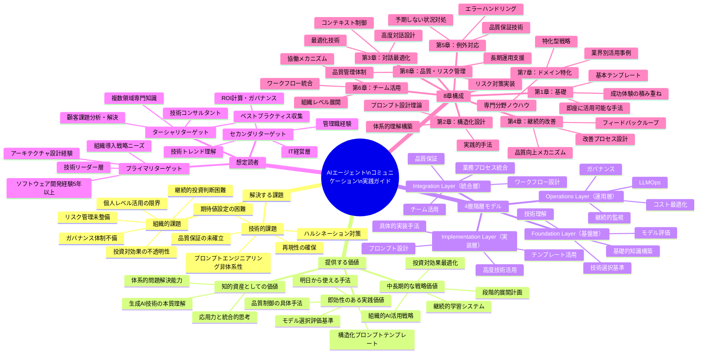
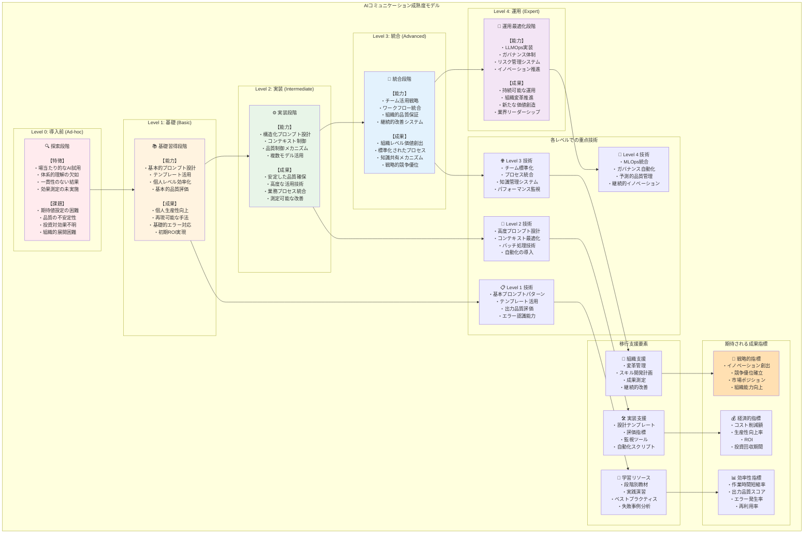

# はじめに

本書『AIエージェント・コミュニケーション実践ガイド』へようこそ。

現在、生成AI技術の急速な発展により、私たちの働き方、コミュニケーションの方法、そして価値創造のアプローチが根本的に変化しています。しかし、多くの技術者や経営者が直面している現実は、AIの可能性を理解しながらも、それを効果的に活用するための体系的な手法が不足していることです。

## 本書が解決する課題

### 技術的課題
- **プロンプトエンジニアリングの非体系性**: 現在多くの組織で、AIとの対話は場当たり的なアプローチに留まっており、再現可能で品質の安定した手法が確立されていません
- **期待値設定の困難**: AIの能力と制約に対する理解が不十分なため、現実的でない期待を抱き、失望や諦めにつながるケースが頻発しています
- **品質保証の未確立**: ハルシネーションや一貫性の問題への対策が明確でなく、業務での本格活用に踏み切れない状況が続いています

### 組織的課題
- **個人レベルでの活用の限界**: AI活用が個人の効率化に留まり、組織全体の価値創出や競争優位確立に至っていません
- **ガバナンス体制の不備**: リスク管理やコンプライアンス対応が未整備で、組織的な展開に不安を抱えています
- **投資対効果の不透明性**: ROI測定手法が確立されておらず、継続的な投資判断に困難を感じています

## 本書が提供する価値

### 即効性のある実践的価値
- **構造化プロンプトテンプレート**: 明日から使える、再現性の高いコミュニケーション手法
- **モデル選択の評価基準**: 目的に応じた最適なAIモデル選択のための客観的指標
- **品質制御の具体的手法**: ハルシネーション検出と対策の実装可能な技術

### 中長期的な戦略価値
- **組織的AI活用戦略**: 個人レベルから組織レベルへの展開戦略と実行能力
- **継続的学習システム**: 技術進化に対応できる組織的学習の仕組み
- **投資対効果の最適化**: 測定可能な価値創出による継続的改善

### 知的資産としての価値
- **生成AI技術の本質理解**: 表面的な活用法ではなく、技術の本質を理解することによる応用力
- **体系的問題解決能力**: 断片的知識ではなく、統合的なフレームワークによる課題解決力

## 本書の独自性と差別化

### 4層階層モデルによる体系的アプローチ
他の多くの書籍が断片的な知識や技術の羅列に留まる中、本書では以下の4層からなる統合的なフレームワークを提供します：

1. **Foundation Layer（基盤層）**: 技術理解とモデル評価
2. **Implementation Layer（実装層）**: プロンプト設計と高度技術活用
3. **Integration Layer（統合層）**: 業務プロセス統合と品質保証
4. **Operations Layer（運用層）**: LLMOpsとガバナンス

### LLMOpsを含む運用技術の実装詳細
概念的説明に留まらず、実際の運用で必要となる以下の詳細を提供します：
- プロンプト管理とバージョニングシステム
- コスト最適化と性能監視
- 自動化による運用効率化

### 定量的評価手法の具体化
感覚的な評価から脱却し、以下の測定可能な手法を提示します：
- 業界標準ベンチマークによる客観的評価
- 成熟度レベル別の実装ロードマップ
- KPI設定と継続的改善の仕組み

## 想定読者

### プライマリターゲット：技術リーダー層
- **技術的背景**: ソフトウェア開発経験5年以上、アーキテクチャ設計経験
- **現在の課題**: AI活用の技術実装、組織導入戦略、品質保証体制の設計
- **期待する成果**: 組織的AI活用アーキテクチャの設計能力、技術選定基準の獲得

### セカンダリターゲット：IT経営層
- **技術的背景**: IT業界での管理職経験、技術トレンド理解
- **現在の課題**: AI投資のROI計算、組織ガバナンス、競争優位確立
- **期待する成果**: AI活用による事業価値創出戦略、組織変革マネジメント能力

### ターシャリターゲット：技術コンサルタント
- **技術的背景**: 複数領域の専門知識、顧客課題の分析・解決提案経験
- **現在の課題**: クライアント向けAI活用提案、ベストプラクティス収集
- **期待する成果**: 業界別コンサルティング能力、技術評価・選定支援のメソドロジー

## 本書の構成

本書は以下の8章で構成されています：

**第1章：即座に活用できるAIコミュニケーション基礎**  
明日から使える基本的な手法とテンプレートを提供

**第2章：構造化思考でプロンプトを設計する**  
効果的なプロンプト設計の理論と実践的手法

**第3章：コンテキスト制御による対話の最適化**  
コンテキストを意識した高度な対話設計技術

**第4章：フィードバックループによる継続的改善**  
品質向上のための継続的改善メカニズム

**第5章：エラーハンドリングと例外対応**  
予期しない状況への対処法と品質保証技術

**第6章：チーム活用とワークフロー統合**  
組織レベルでのAI活用とワークフロー設計

**第7章：ドメイン特化型AI活用法**  
業界・分野別の専門的活用事例とノウハウ

**第8章：品質保証とリスク管理**  
長期的な運用を支える品質管理とリスク対策

## 読み進め方

本書は段階的な学習を前提として設計されています：

> **読者別の読み方の目安**
> - 技術リーダー層の読者は、第1章で即効性のある活用を体験したうえで、第2〜4章で構造化思考とコンテキスト制御を押さえ、その後第6〜8章でチーム展開・品質保証・リスク管理を重点的に読むとよい。
> - ビジネス職やIT経営層の読者は、第1章と第4・6・8章を先に読み、業務フローや投資対効果・ガバナンスの観点を押さえたあとで、必要に応じて第2・3章の技術的な詳細を参照すると効率的である。
> - 個人での実務活用から始めたい読者は、第1〜3章を一通り試したうえで、自分の業務領域に近い第7章のドメイン特化事例を参照する読み方も選択できる。
> すべての章を順番どおりに読む必要はなく、自分の役割と課題に応じて優先順位を付けて構わない。

1. **第1章で即効性を体験**: まず具体的な成功体験を積む
2. **第2-3章で理論的基盤を構築**: 体系的な理解を深める
3. **第4-5章で品質向上を図る**: より高度で安定した活用を実現
4. **第6-8章で組織展開を計画**: 個人から組織への拡張

各章には実践的な演習と振り返りが含まれており、読むだけでなく実際に手を動かしながら学習を進めることで、確実にスキルを身につけられます。

---

AI技術の進化は止まることがありません。本書が提供するのは、この変化の激しい時代において、継続的に価値を創出し続けるための「考え方」と「実践方法」です。一時的な技術トレンドではなく、本質的なコミュニケーション能力の向上を通じて、AI時代の新しい働き方を確立していきましょう。

それでは、AIエージェント・コミュニケーションの実践的な学習を始めましょう。
